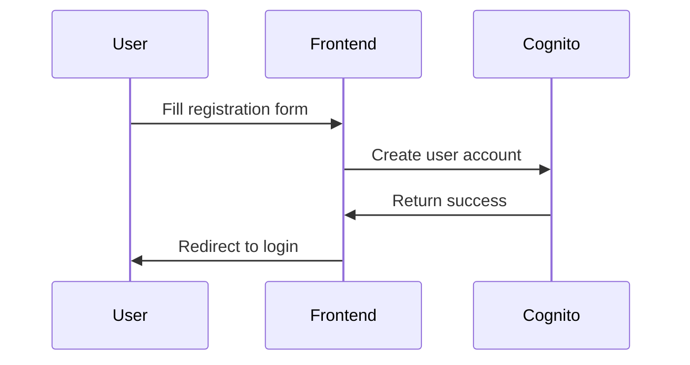
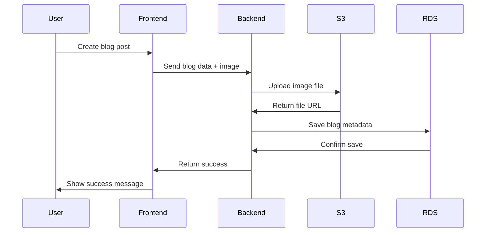
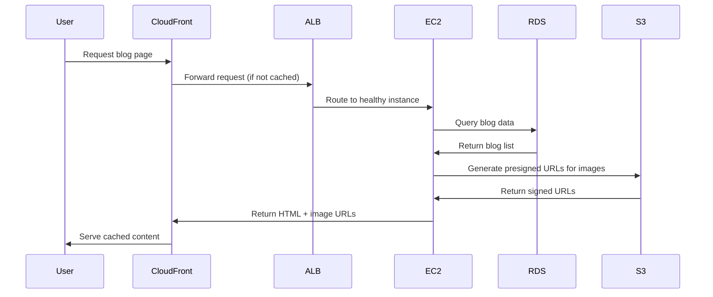
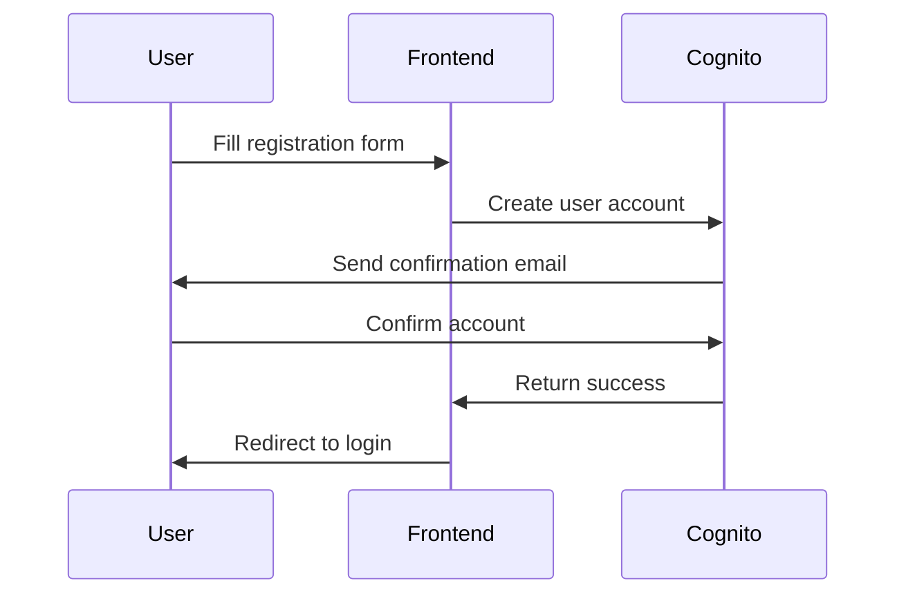

# 📝 Group6 Simple Blog Platform - AWS Cloud Architecture

## 🎯 Tổng quan ứng dụng

Ứng dụng blog đơn giản được thiết kế để demo việc triển khai một hệ thống web hoàn chỉnh trên AWS Cloud, bao gồm các thành phần từ frontend, backend, database đến các dịch vụ quản lý như authentication, storage và monitoring.

## 🏗️ Kiến trúc hệ thống AWS

```
┌─────────────┐    ┌──────────────┐
│   Internet  │────│  CloudFront  │
└─────────────┘    └──────────────┘
                            │
                   ┌──────────────┐
                   │  S3 Bucket   │ (Static Files)
                   └──────────────┘
                            │
            ┌───────────────────────────────────┐
            │              VPC                  │
            │  ┌─────────────────────────────┐  │
            │  │      Public Subnets         │  │
            │  │  ┌─────────────────────────┐ │  │
            │  │  │   Application Load      │ │  │
            │  │  │     Balancer (ALB)      │ │  │
            │  │  └─────────────────────────┘ │  │
            │  └─────────────────────────────┘  │
            │              │                    │
            │  ┌─────────────────────────────┐  │
            │  │      Private Subnets        │  │
            │  │  ┌─────────┐ ┌─────────────┐ │  │
            │  │  │   EC2   │ │   EC2       │ │  │
            │  │  │Instance │ │  Instance   │ │  │
            │  │  │   AZ-1  │ │    AZ-2     │ │  │
            │  │  └─────────┘ └─────────────┘ │  │
            │  └─────────────────────────────┘  │
            │              │                    │
            │  ┌─────────────────────────────┐  │
            │  │      Database Subnets       │  │
            │  │  ┌─────────────────────────┐ │  │
            │  │  │    RDS MySQL Cluster    │ │  │
            │  │  │      (Multi-AZ)         │ │  │
            │  │  └─────────────────────────┘ │  │
            │  └─────────────────────────────┘  │
            └───────────────────────────────────┘
                            │
                   ┌──────────────┐
                   │ AWS Cognito  │ (Authentication)
                   └──────────────┘
                            │
            ┌─────────────────────────────────────┐
            │           Monitoring                │
            │  ┌─────────────┐ ┌──────────────┐   │
            │  │ CloudWatch  │ │ CloudTrail   │   │
            │  │   Metrics   │ │    Logs      │   │
            │  └─────────────┘ └──────────────┘   │
            └─────────────────────────────────────┘
```

### High Level Architecture Components:
- **Amazon VPC**: Mạng ảo cô lập với 2 AZ để đảm bảo High Availability
- **Application Load Balancer (ALB)**: Phân phối lưu lượng và health check
- **Amazon CloudFront**: CDN toàn cầu để tăng tốc truy cập nội dung
- **Amazon EC2**: 2 instances t2.micro chạy Node.js application với Auto Scaling
- **Amazon RDS MySQL**: Database cluster với Multi-AZ deployment
- **Amazon S3**: Object storage cho hình ảnh và static files
- **AWS Cognito**: User Pool để quản lý authentication
- **IAM Roles & Policies**: Quản lý quyền truy cập các AWS services
- **Security Groups**: Network-level security controls
- **Amazon CloudWatch**: Metrics, alarms và application monitoring
- **AWS CloudTrail**: API calls auditing và compliance

## 🔧 Technology Stack

### Frontend
- **HTML5 + CSS3**: Responsive design với Bootstrap 5
- **Vanilla JavaScript**: Client-side logic và API interactions
- **Bootstrap Icons**: Icon library
- **Progressive Web App**: Offline support và mobile optimization

### Backend
- **Node.js**: Runtime environment
- **Express.js**: Web framework với RESTful APIs
- **Multer**: File upload middleware
- **JWT**: Token-based authentication
- **PM2**: Process manager cho production

### Database
- **MySQL 8.0**: Relational database trên RDS
- **Connection pooling**: Optimize database connections
- **Automated backups**: Daily backups với 7-day retention
- **Multi-AZ deployment**: High availability setup

### AWS Integration
- **AWS SDK for JavaScript**: Tích hợp với các AWS services
- **S3 Presigned URLs**: Secure file upload/download
- **Cognito JWT verification**: Token validation
- **CloudWatch SDK**: Custom metrics và logging

## 🔄 Application Flow & User Journey

### User Registration Flow


### Blog Creation Flow  


### Content Delivery Flow


## 🔧 Technology Stack

### Frontend
- **HTML5 + CSS3**: Responsive design với Bootstrap 5
- **Vanilla JavaScript**: Client-side logic và API interactions
- **Bootstrap Icons**: Icon library
- **Progressive Web App**: Offline support và mobile optimization

### Backend
- **Node.js**: Runtime environment
- **Express.js**: Web framework với RESTful APIs
- **Multer**: File upload middleware
- **JWT**: Token-based authentication
- **PM2**: Process manager cho production

### Database
- **MySQL 8.0**: Relational database trên RDS
- **Connection pooling**: Optimize database connections
- **Automated backups**: Daily backups với 7-day retention
- **Multi-AZ deployment**: High availability setup

### AWS Integration
- **AWS SDK for JavaScript**: Tích hợp với các AWS services
- **S3 Presigned URLs**: Secure file upload/download
- **Cognito JWT verification**: Token validation
- **CloudWatch SDK**: Custom metrics và logging

## 🔄 Application Flow & User Journey

### User Registration Flow


### Blog Creation Flow  


### Content Delivery Flow


## 💰 Cost Analysis & Optimization

### Monthly Cost Breakdown (us-east-1)
```
┌─────────────────────────┬─────────────┬──────────────┐
│       Service           │  Free Tier  │   Standard   │
├─────────────────────────┼─────────────┼──────────────┤
│ EC2 t2.micro (2 units)  │    $0       │    $16.56    │
│ RDS db.t3.micro         │    $0       │    $15.33    │
│ Application Load        │    $0       │    $16.20    │
│ Balancer                │             │              │
│ S3 Storage (5GB)        │    $0       │    $0.12     │
│ CloudFront (100GB)      │    $0       │    $8.50     │
│ Data Transfer           │    $0       │    $4.50     │
│ CloudWatch Logs         │    $0       │    $2.50     │
│ Cognito (MAU < 50k)     │    $0       │    $0        │
│ NAT Gateway             │    $0       │    $32.40    │
├─────────────────────────┼─────────────┼──────────────┤
│ TOTAL MONTHLY           │    $0       │   $96.11     │
└─────────────────────────┴─────────────┴──────────────┘
```

## � Technology Stack

### Frontend
- **HTML5 + CSS3**: Responsive design với Bootstrap 5
- **Vanilla JavaScript**: Client-side logic và API interactions
- **Bootstrap Icons**: Icon library
- **Progressive Web App**: Offline support và mobile optimization

### Backend
- **Node.js**: Runtime environment
- **Express.js**: Web framework với RESTful APIs
- **Multer**: File upload middleware
- **JWT**: Token-based authentication
- **PM2**: Process manager cho production

### Database
- **MySQL 8.0**: Relational database trên RDS
- **Connection pooling**: Optimize database connections
- **Automated backups**: Daily backups với 7-day retention
- **Multi-AZ deployment**: High availability setup

### AWS Integration
- **AWS SDK for JavaScript**: Tích hợp với các AWS services
- **S3 Presigned URLs**: Secure file upload/download
- **Cognito JWT verification**: Token validation
- **CloudWatch SDK**: Custom metrics và logging

## 🚀 Infrastructure Features

### High Availability & Scalability
- **Multi-AZ Deployment**: 2 Availability Zones để đảm bảo uptime 99.9%
- **Auto Scaling Groups**: Tự động scale từ 2-6 instances dựa trên CPU usage
- **Load Balancer Health Checks**: Tự động remove unhealthy instances
- **Database Failover**: Automatic failover trong 1-2 phút

### Security Best Practices
- **Private Subnets**: EC2 instances không có direct internet access
- **NAT Gateway**: Secure outbound internet cho private instances
- **Security Groups**: Least privilege network access
- **IAM Roles**: No hardcoded credentials trong application code
- **VPC Flow Logs**: Network traffic monitoring

### Performance Optimization
- **CloudFront CDN**: Global edge locations cho static content
- **S3 Transfer Acceleration**: Fast file uploads
- **Application-level Caching**: In-memory caching cho frequent queries
- **Optimized Database Queries**: Indexed queries và connection pooling

### Monitoring & Alerting
- **CloudWatch Dashboards**: Real-time system metrics
- **Custom Metrics**: Application-specific monitoring
- **Log Aggregation**: Centralized logging từ tất cả instances
- **SNS Notifications**: Email alerts cho critical issues
